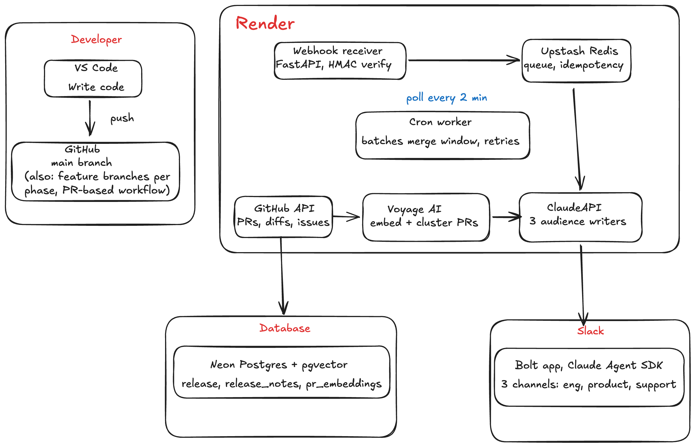

# PatchNote

**Live demo**: https://patchnote-seven.vercel.app

PatchNote watches a GitHub repository for merged pull requests and automatically generates three audience-specific release notes, one for engineering, one for product, and one for support, then posts each to its own dedicated Slack channel with an approve/reject workflow. Approved notes appear on a public changelog page.

## Architecture



## What it does

1. A pull request gets merged on a watched GitHub repository.
2. GitHub sends a webhook to PatchNote's receiver.
3. The merge is added to a short batching window so multiple PRs merged close together get summarized together instead of spamming separate messages.
4. Once the window closes, the system fetches the PR's title, description, labels, linked issues, and diff directly from GitHub.
5. Each PR is embedded into a vector and compared against the others in the batch. Related changes are clustered together so the writer treats them as one theme rather than disconnected bullet points.
6. Claude generates three different documents from the same source material:
   - **Engineering**: technical changelog, breaking changes, migration notes
   - **Product**: plain-English feature narrative for stakeholders
   - **Support**: customer-facing talking points and known limitations
7. Every release and its three notes are persisted to Postgres.
8. The three notes are posted to their own Slack channels with Approve and Reject buttons.
9. Approved notes appear on the public changelog page at the live demo URL above.

## Tech stack

| Layer | Technology |
|---|---|
| Slack integration | Slack Bolt for Python, Claude Agent SDK, custom MCP tools |
| Webhook receiver | FastAPI, deployed on Render (Web Service) |
| Queue and batching | Upstash Redis (REST API, async client) |
| Background processing | Render Cron Job, polling on a 15-minute schedule |
| GitHub integration | GitHub REST API via custom async tools (`get_recent_prs`, `get_pr_details`, `get_pr_diff`) |
| Embeddings | Voyage AI, `voyage-4-lite`, 512-dimension vectors |
| Clustering | Cosine similarity, single-link clustering, threshold 0.80 |
| Generation | Anthropic Claude API, direct single-shot calls (Haiku for development, Sonnet for production) |
| Persistence | Neon Postgres with the `pgvector` extension, SQLAlchemy async ORM |
| Frontend | Next.js on Vercel, public changelog page with aggregated multi-repo feed |
| Reliability | Idempotency keys (24hr TTL), retry with requeue (max 3 attempts), daily generation budget cap, dry-run mode |

## Key design decisions

**Agent SDK only where reasoning is needed.** The GitHub data-gathering step uses the Claude Agent SDK with custom MCP tools because the agent genuinely decides which tool to call and when. The three generation steps use plain, single-shot Anthropic API calls instead, since writing audience-specific notes from already-gathered data is not an agentic task. This split cut token usage and cost substantially.

**Embeddings and clustering are functional, not decorative.** Each PR is embedded individually, then PRs above a similarity threshold are grouped before generation. A release with three commits to the same feature gets summarized as one coherent theme instead of three disconnected bullet points.

**Cron over a long-running worker.** The worker was restructured to run a single pass and exit, triggered by a scheduled cron job every 15 minutes. This is a legitimate, low-cost pattern for batch-style background processing.

**Merge window batching.** PRs merged within a short window of each other are batched into a single digest per audience, preventing per-PR channel spam.

**No user accounts or authentication.** The system stores no personal data. The only identities involved are the Slack workspace (authenticated by Slack itself) and a GitHub repository.

**Cost guardrails.** A `PATCHNOTE_DRY_RUN` flag skips all model calls and returns placeholder text, allowing the entire pipeline to be exercised for free. A `PATCHNOTE_DAILY_BUDGET` enforces a hard cap on generation calls per day.

## Local development

Three processes run concurrently during local development:

```bash
# Terminal 1: the Slack Bolt app (Socket Mode)
slack run

# Terminal 2: the worker, continuous polling loop
python3 worker.py

# Terminal 3: the webhook receiver
uvicorn webhook:app --reload --port 8080
```

Simulate a GitHub webhook locally:

```bash
curl -X POST http://localhost:8080/webhook/github \
  -H "Content-Type: application/json" \
  -H "X-GitHub-Event: pull_request" \
  -d '{
    "action": "closed",
    "pull_request": {
      "number": 1,
      "title": "Example PR",
      "merged": true,
      "merged_at": "2026-01-01T00:00:00Z"
    },
    "repository": { "full_name": "owner/repo" }
  }'
```

Register a repo for the public changelog feed:

```bash
python3 register_repo.py owner/repo "Display Name"
```

## Deployment

- **Webhook receiver**: Render Web Service, `uvicorn webhook:app --host 0.0.0.0 --port $PORT`
- **Worker**: Render Cron Job, `python3 worker_once.py`, scheduled every 15 minutes
- **Frontend**: Vercel, root directory set to `my-app`

## Environment variables
ANTHROPIC_API_KEY
GITHUB_TOKEN
GITHUB_WEBHOOK_SECRET
SLACK_BOT_TOKEN
SLACK_APP_TOKEN
VOYAGE_API_KEY
UPSTASH_REDIS_REST_URL
UPSTASH_REDIS_REST_TOKEN
DATABASE_URL
PATCHNOTE_ENGINEERING_CHANNEL
PATCHNOTE_PRODUCT_CHANNEL
PATCHNOTE_SUPPORT_CHANNEL
PATCHNOTE_MERGE_WINDOW
PATCHNOTE_DRY_RUN
PATCHNOTE_DAILY_BUDGET
PATCHNOTE_POLL_INTERVAL
PATCHNOTE_MAX_RETRIES

## Status

The full pipeline is deployed and confirmed working end to end. The public changelog at [patchnote-seven.vercel.app](https://patchnote-seven.vercel.app) aggregates approved release notes across every connected repository, updated automatically as new PRs merge.